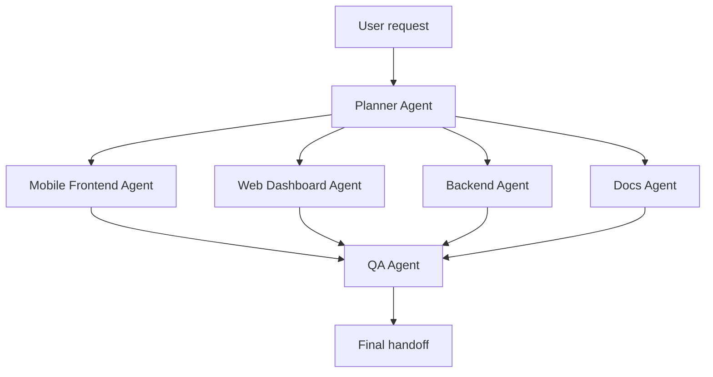

# Hoomy Mission Control

## Purpose

This file explains how to coordinate AI agents for Hoomy.

The setup follows four practical agent design ideas:

1. Decompose complex work into smaller tasks.
2. Use specialized agents for different expertise.
3. Keep visibility into what each agent changed and verified.
4. Keep a human in the loop for high-risk decisions.

## Default orchestration



## When to use each agent

| Request type | Primary agent | Secondary agent |
| --- | --- | --- |
| Break down a large task | Planner | Docs |
| Customer app screen | Mobile Frontend | QA |
| Supplier cabinet | Web Dashboard | QA |
| Admin panel | Web Dashboard | QA |
| API contract | Backend | Mobile/Web, QA |
| Prisma/database | Backend | QA |
| Update docs | Docs | Planner |
| Find bugs/regressions | QA | Relevant implementer |

## Current project mode

Current mode:

```text
frontend-first / mocks-first
```

This means agents should optimize for:

* clickable user flows;
* realistic mocks;
* clean data boundaries;
* easy future API replacement.

## High-risk decisions requiring user confirmation

* payment provider;
* SMS provider;
* production hosting;
* legal/personal data choices;
* real credentials;
* destructive commands;
* changing delivery/product ownership model.

## Handoff contract

Every agent must finish with:

```text
Changed:
- ...

Verified:
- ...

Remaining:
- ...
```
