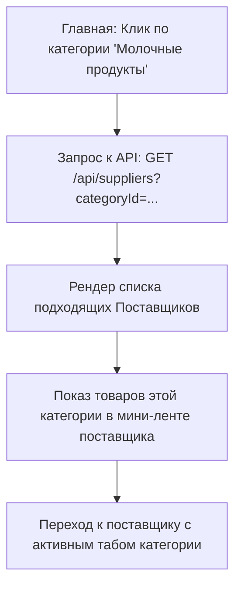
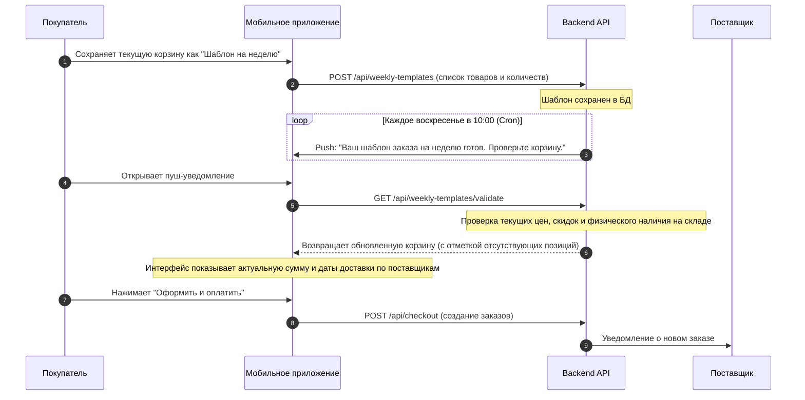

# Архитектурная спецификация (RFC): Новые разделы и логика Hoomy

Этот документ содержит детальное проектирование и техническую спецификацию для бэкенда (API и базы данных), мобильного приложения покупателя (`apps/mobile`) и кабинета поставщиков (`apps/web`).

---

## 1. Популярное у поставщиков (Popular Items)

Функционал решает задачу продвижения высокооборачиваемых товаров и облегчения первого заказа клиента. 

### Механизм реализации
Мы объединяем два подхода:
1. **Статический (Supplier/Admin Control)**: Флаг `isPopular` на уровне товара, который поставщик может установить в своем кабинете (с лимитом, например, не более 5 товаров от одного поставщика), либо администратор может принудительно закрепить товар.
2. **Динамический (Dynamic Aggregation)**: Поле `popularityScore` на бэкенде. Оно рассчитывается периодической фоновой задачей (Cron) на основе количества оплат товара из таблицы `analytics_events` (события `ORDER_PAID`) за последние 30 дней.

### Базовый алгоритм выдачи
```text
Сортировка списка товаров поставщика:
1. isPopular = true (поставщик/админ явно выделили)
2. popularityScore DESC (популярные по реальным покупкам)
3. createdAt DESC (новинки)
```

---

## 2. Экран Поставщика (Каталог и Карточка)

Когда клиент переходит с главного экрана в карточку поставщика, он видит полноценную торговую витрину с возможностью быстрого наполнения корзины.

### Спецификация UI/UX структуры
```text
+---------------------------------------------------------+
| [Назад]               [Поиск по поставщику...]          |
+---------------------------------------------------------+
|  Баннер Поставщика (Фон)                                |
|  [Лого]  Фермер Казань                 ★ 4.9 (42 отзыва) |
|  ИНН: 1655012345 | Казань                               |
|                                                         |
|  Условия заказа:                                        |
|  • Мин. заказ: 3 000 ₽     • Доставка: 200 ₽ (0 ₽ от 5к)|
|  • Ближайшая доставка: Вторник                          |
+---------------------------------------------------------+
| [ Все ] [ Молоко ] [ Мясо ] [ Овощи ] (Категории-табы)   |
+---------------------------------------------------------+
| Товары:                                                 |
| +-----------------------------------------------------+ |
| | Картинка  Молоко фермерское 3.2%                    | |
| |           Цена: 85 ₽ / 1 л                          | |
| |           Мин. партия: 6 л (510 ₽)                  | |
| |           [ Добавить в корзину (Мин: 6 л) ]         | |
| +-----------------------------------------------------+ |
| | Картинка  Яйца куриные С0                           | |
| |           Цена: 300 ₽ / уп (30 шт)                  | |
| |           Мин. партия: 1 уп (300 ₽)                 | |
| |           [ - ] [ 30 шт ] [ + ]   Шаг: 30 шт        | |
| +-----------------------------------------------------+ |
+---------------------------------------------------------+
```

### Ключевые элементы каталога
* **Калькулятор минимальной партии**: Рядом с ценой за единицу всегда пишется: «Мин. партия: X единиц (Y ₽)». Клиент сразу понимает финансовый порог входа.
* **Категории-табы**: Горизонтальная карусель категорий, присутствующих у данного поставщика. Клик по табу скроллит страницу к соответствующему разделу или фильтрует список.
* **Контекстный поиск**: Инпут в шапке осуществляет полнотекстовый поиск исключительно по товарам этого поставщика.

---

## 3. Навигация по категориям (Category Transitions)

На главном экране мобильного приложения выводится сетка глобальных категорий (например, «Молочные продукты», «Овощи и фрукты», «Свежее мясо»).

### Логика перехода и фильтрации
Так как Hoomy — это **поставщик-ориентированный** маркетплейс (корзина и доставка группируются вокруг поставщика), переход по категории работает по следующему сценарию:
1. Клиент нажимает на плитку категории «Молочные продукты».
2. Система открывает список поставщиков, отфильтрованных по этой категории.
3. В карточке каждого поставщика в ленте отображается горизонтальная микро-карусель товаров **именно из выбранной категории**.
4. При переходе внутрь поставщика категория «Молочные продукты» автоматически выбирается в качестве активного таба.



---

## 4. Закупка на неделю (Weekly Bulk Order)

«Закупка на неделю» — ключевой инструмент долгосрочного планирования расходов семьи на продукты питания.

### Почему автоматическая автоподписка (автосписание) НЕ РАБОТАЕТ для свежих продуктов:
1. **Нестабильность остатков**: У фермера в воскресенье может не оказаться 10 кг нужного картофеля или творога. Автозаказ упадет в ошибку.
2. **Динамическое ценообразование**: Цены на сезонные овощи или свежее мясо меняются еженедельно. Списывать деньги без ведома клиента незаконно и вызывает негатив.
3. **Разные графики**: Поставщик А возит по вторникам, а Поставщик Б — по пятницам. Автоматически объединить это в одну доставку невозможно.

### Наше решение: Интеллектуальные шаблоны закупок (Smart Weekly Templates)
Вместо жесткой подписки мы проектируем полуавтоматический сценарий с подтверждением:



---

## 5. B2B-программа (Для Кафе, Ресторанов и Опт)

Кафе и ресторанам нужны большие объемы, специальные цены, оплата по безналичному расчету (оплата по счету) и закрывающие документы для бухгалтерии (УПД).

### Продуктовое решение для MVP (B2B Lead & Wholesale Accounts)
Мы внедряем B2B-слой через следующие этапы:

1. **Регистрация / Заявка**:
   * В профиле мобильного приложения и в веб-портале размещается баннер: *«Покупаете для бизнеса? Подключите B2B-аккаунт»*.
   * Открывается форма заявки: Название организации, ИНН, КПП (для ООО), телефон, E-mail и планируемый объем закупок.
   * Данные отправляются на сервер в таблицу `b2b_leads`.

2. **Модерация и активация**:
   * Администратор в панели `admin` видит заявку, проверяет ИНН через ЕГРЮЛ (можно подключить DaData на следующем этапе).
   * Администратор меняет роль пользователя с `CUSTOMER` на `B2B_CUSTOMER` (или включает флаг `isB2BEnabled`).

3. **Особые условия в каталоге**:
   * Когда залогинен пользователь с ролью `B2B_CUSTOMER`, для товаров подгружается оптовая цена (поле `b2bPriceKopecks`) вместо базовой.
   * Минимальный порог заказа (`minQuantity`) для B2B-клиентов автоматически возрастает (например, молоко продается только коробками по 24 литра, а мясо — тушами от 20 кг).

4. **Оплата по счету (Invoice Payment)**:
   * При чекауте для B2B-клиентов появляется способ оплаты: *«Оплата по безналичному расчету (по счету)»*.
   * Система генерирует PDF-счет на оплату и отправляет на почту клиенту. Заказ переходит в статус `AWAITING_B2B_PAYMENT`. После подтверждения бухгалтером в админке статус меняется на `PAID`.

---

## 6. Система скидок (Discounts Engine)

Скидки стимулируют быстрые оптовые продажи излишков продуктов.

### Изменения в данных
Каждый товар (`Product`) получает опциональное поле `discountPriceKopecks`.
* Если `discountPriceKopecks === null` — товар продается по обычной цене `priceKopecks`.
* Если `discountPriceKopecks !== null` — товар на витрине отображается со скидкой.

### Отображение на UI (Double-Price Visualization)
* Показывается старая цена `priceKopecks` серым шрифтом с перечеркиванием.
* Показывается новая цена `discountPriceKopecks` крупным ярким цветом (`#FF6500` или `#FF3B30`).
* Автоматически рассчитывается процент скидки:
  $$\text{Процент} = \text{round}\left( \frac{\text{price} - \text{discountPrice}}{\text{price}} \times 100 \right)$$
* Выводится бейдж скидки: например, ` -15% `.
* **Цена минимальной партии** пересчитывается по новой скидочной цене, повышая привлекательность сделки: `Мин. партия: 10 кг (800 ₽ вместо 1000 ₽)`.

---

## 7. Логика Степпера Количества (Stepper UX Rules)

Степпер должен четко следовать правилам шага и минимального объема, исключая ввод некорректных значений.

### Алгоритм работы степпера в UI:
1. **Состояние 0**: Кнопка «В корзину (Мин: X)».
2. **Первое нажатие**: В корзину добавляется сразу `minQuantity`.
3. **Нажатие на "+"**: Значение увеличивается на `orderStep` (не на 1!).
4. **Нажатие на "-"**: 
   * Если текущее значение больше `minQuantity`, оно уменьшается на `orderStep`.
   * Если текущее значение равно `minQuantity`, нажатие на "-" удаляет товар из корзины (устанавливает в 0).

### Примеры расчетов степпера для разных категорий:

| Продукт | Единица | Мин. объем (`minQuantity`) | Шаг заказа (`orderStep`) | Остаток (`stockQuantity`) | Последовательность кликов на "+" |
| --- | --- | --- | --- | --- | --- |
| **Молоко** | литр | 6.0 | 1.0 | 15.0 | `0` → `6.0` → `7.0` → `8.0` ... → `15.0` (блок "+") |
| **Картофель** | кг | 10.0 | 5.0 | 100.0 | `0` → `10.0` → `15.0` → `20.0` → `25.0` ... |
| **Яйца** | шт | 30.0 | 30.0 | 120.0 | `0` → `30.0` → `60.0` → `90.0` → `120.0` (блок "+") |
| **Трюфели** | кг | 0.1 | 0.1 | 2.5 | `0` → `0.1` → `0.2` → `0.3` → `0.4` ... |

---

## 8. Спецификация изменений Базы Данных (Prisma Schema Draft)

Для поддержки новых функций в схему данных вносятся следующие дополнения:

```prisma
// Дополнения в существующие модели

model Product {
  // ... существующие поля
  isPopular               Boolean   @default(false)
  popularityScore         Float     @default(0.0)
  discountPriceKopecks    Int?      // Цена со скидкой (в копейках)
  b2bPriceKopecks         Int?      // Оптовая цена для ресторанов (в копейках)
  b2bMinQuantity          Decimal?  @db.Decimal(10, 2) // Оптовый минимум
}

model Supplier {
  // ... существующие поля
  isB2B                   Boolean   @default(false) // Поставщик работает с оптом
}

model User {
  // Добавление новой роли B2B_CUSTOMER к UserRole
}

// Новые таблицы для функционала

model B2BLead {
  id                      String    @id @default(uuid())
  userId                  String    @unique
  companyName             String
  inn                     String    @db.VarChar(12)
  kpp                     String?   @db.VarChar(9)
  phone                   String
  email                   String
  estimatedVolumeText     String?   @db.Text
  status                  LeadStatus @default(PENDING)
  createdAt               DateTime  @default(now())
  updatedAt               DateTime  @updatedAt
}

enum LeadStatus {
  PENDING
  APPROVED
  REJECTED
}

model WeeklyTemplate {
  id                      String    @id @default(uuid())
  userId                  String    @unique
  name                    String    @default("Моя закупка на неделю")
  isActive                Boolean   @default(true)
  items                   WeeklyTemplateItem[]
  createdAt               DateTime  @default(now())
  updatedAt               DateTime  @updatedAt
}

model WeeklyTemplateItem {
  id                      String    @id @default(uuid())
  templateId              String
  template                WeeklyTemplate @relation(fields: [templateId], references: [id], onDelete: Cascade)
  productId               String
  quantity                Decimal   @db.Decimal(10, 2)
  createdAt               DateTime  @default(now())
}
```

---

## 9. Новые контракты API (JSON REST Contracts)

### А. Заявка на B2B-аккаунт
**`POST /api/b2b/register`**
* Запрос:
  ```json
  {
    "companyName": "ООО Ромашка Кафе",
    "inn": "7704123456",
    "kpp": "770401001",
    "phone": "+79991234567",
    "email": "purchasing@romashkacafe.ru",
    "estimatedVolumeText": "Около 200 литров фермерского молока в неделю"
  }
  ```
* Ответ `201 Created`:
  ```json
  {
    "id": "lead_123",
    "status": "PENDING"
  }
  ```

### Б. Шаблоны еженедельной закупки
**`POST /api/weekly-templates`**
* Создать или обновить шаблон:
  ```json
  {
    "items": [
      { "productId": "p1", "quantity": 15.0 },
      { "productId": "p3", "quantity": 8.0 }
    ]
  }
  ```

**`GET /api/weekly-templates/validate`**
* Запрос актуального состояния шаблона (наличие, цены, скидки):
* Ответ `200 OK`:
  ```json
  {
    "templateId": "tmpl_999",
    "items": [
      {
        "productId": "p1",
        "name": "Картофель молодой",
        "requestedQuantity": 15.0,
        "availableQuantity": 15.0,
        "priceKopecks": 3800,
        "discountPriceKopecks": 3000,
        "inStock": true
      },
      {
        "productId": "p3",
        "name": "Молоко фермерское",
        "requestedQuantity": 8.0,
        "availableQuantity": 0.0,
        "priceKopecks": 8500,
        "discountPriceKopecks": null,
        "inStock": false // Предупреждение о дефиците на складе поставщика
      }
    ],
    "totalDiscountPriceKopecks": 45000, // Сумма с учетом текущих скидок
    "validationErrors": [
      "Товар 'Молоко фермерское' временно отсутствует на складе поставщика."
    ]
  }
  ```

---

## 10. Алгоритм ранжирования поставщиков и система бустинга (Ranking & Boost Engine)

Для обеспечения здоровой конкуренции, высокого качества сервиса и монетизации платформы Hoomy использует гибридную систему ранжирования поставщиков в общей ленте.

### А. Факторы ранжирования (Input Signal Matrix)

Система ранжирования делит сигналы на три категории: жесткие ограничения, органические показатели качества и коммерческий буст.

1. **Жесткие ограничения (Hard Constraints / Filters)**:
   * **Соответствие геозоне**: Если адрес доставки клиента не входит в полигон (`Polygon`) ни одной из активных зон поставщика (`delivery_zones`), поставщик скрывается из ленты или опускается в самый низ в специальный блок «Не доставляют вам».
   * **Статус верификации**: Поставщики со статусом, отличным от `APPROVED`, полностью исключаются из выдачи.

2. **Органические показатели качества (Organic Ranking Factors)**:
   * **Средний рейтинг ($R$)**: Базовый множитель качества (средняя оценка покупателей). Рейтинг ниже 4.0 пессимизирует позицию; рейтинг ниже 3.5 блокирует выдачу.
   * **Объем успешных заказов ($O_{30}$)**: Количество доставленных без споров заказов за последние 30 дней. Демонстрирует надежность и популярность.
   * **Уровень отмен и споров ($DisputePenalty$)**: Количество открытых и проигранных споров за качество продукции. Накладывает жесткий штраф на позицию.
   * **Конверсия карточки ($CR$)**: Отношение количества заказов к просмотрам профиля поставщика (CTR и CR). Показывает интерес аудитории к ассортименту и ценам.
   * **Географическая близость ($Distance$)**: Расстояние от склада поставщика до адреса клиента (в пределах города). Поставщики, расположенные ближе, ранжируются чуть выше для оптимизации логистического плеча.

3. **Коммерческий буст ($Boost$)**:
   * Платная услуга для поставщиков, временно повышающая их позицию в ленте (применяется как множитель к органическому весу).

---

### Б. Архитектурная формула ранжирования (Коммерческая тайна)

Формула расчета финального балла поставщика ($Score$) выполняется исключительно на стороне бэкенда и защищена коммерческой тайной. Точные весовые коэффициенты регулируются администратором системы и не раскрываются поставщикам во избежание манипуляций алгоритмом.

#### Математическая модель:
$$Score = \Big( R^{\alpha} \cdot (O_{30} + 1)^{\beta} \cdot CR^{\gamma} \cdot \frac{1}{\text{Distance}^{\delta}} - DisputePenalty \Big) \times \Big( 1 + BoostLevel \times M_{safeguard} \Big)$$

Где:
* **$\alpha, \beta, \gamma, \delta$** — весовые коэффициенты калибровки (хранятся в конфиге бэкенда и динамически настраиваются администратором).
* **$DisputePenalty$** — штрафной балл за споры:
  $$DisputePenalty = \text{RefundedDisputes}_{30d} \times \text{PenaltyMultiplier}$$
* **$BoostLevel$** — коэффициент купленного уровня буста:
  * `None` = $0.0$
  * `Tier 1` (Базовый) = $0.15$ (дает +15% к органическому весу)
  * `Tier 2` (Повышенный) = $0.35$ (дает +35% к органическому весу)
  * `Tier 3` (Максимальный) = $0.60$ (дает +60% к органическому весу)
* **$M_{safeguard}$ — Множитель безопасности (Защита от "мусорного" топа)**:
  Платный буст не должен продвигать плохих продавцов. Если рейтинг поставщика падает, эффективность платного буста снижается:
  $$M_{safeguard} = \begin{cases} 
    1.0 & \text{если } R \ge 4.5 \\
    0.5 & \text{если } 4.0 \le R < 4.5 \\
    0.0 & \text{если } R < 4.0 \quad \text{(буст полностью отключается)}
  \end{cases}$$

---

### В. Отображение и интерфейс в Кабинете Поставщика

Чтобы сохранить формулу в секрете, но сделать инструмент бустинга понятным для поставщика, интерфейс кабинета предоставляет только агрегированные показатели:

1. **Метрика «Индекс видимости» (Visibility Index)**:
   * Отображается в виде прогресс-бара от 0% до 100%.
   * Показывает, насколько часто карточка поставщика оказывается в топ-10 выдачи у пользователей в его зонах доставки.
2. **Экран «Продвижение» (Буст)**:
   * Простой выбор тарифных планов (например: *«Поднять видимость на 35% за 1900 ₽ / неделя»*).
   * Четкое предупреждение: *«Внимание! Эффективность продвижения напрямую зависит от вашего рейтинга. При падении рейтинга ниже 4.0 буст временно отключается до исправления качества обслуживания»*.
3. **Советы алгоритма (Подсказки)**:
   * Система автоматически генерирует рекомендации на основе формулы ранжирования:
     * *«У вас высокий уровень возвратов картофеля. Исправьте описание или качество упаковки, чтобы вернуть прежние позиции в ленте»*.
     * *«Снизьте минимальную сумму заказа с 5000 ₽ до 3000 ₽, чтобы увеличить конверсию (CR) и подняться выше в каталоге»*.

