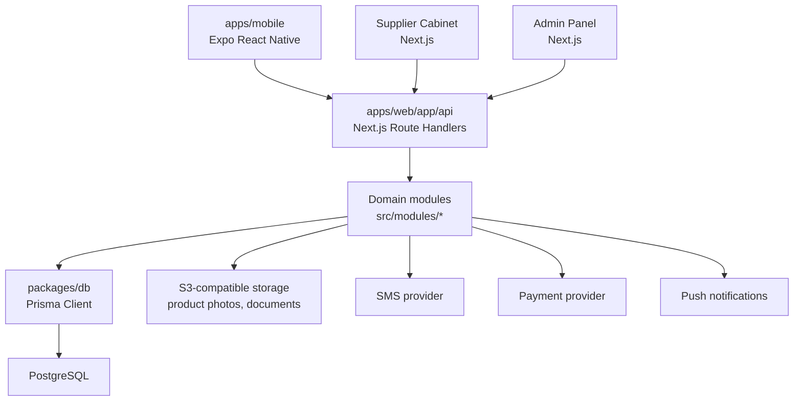

# Architecture: Hoomy / Хоми

## Архитектурная цель

MVP должен быть простым для разработки, но не одноразовым. Поэтому выбираем модульный монолит:

* одна база данных PostgreSQL;
* один backend/API-слой внутри Next.js route handlers;
* мобильное приложение на Expo;
* web-кабинет поставщика и админ-панель на Next.js;
* общие типы, схемы и бизнес-константы в packages.

Такой подход хорошо подходит для вайб-кодинга: меньше сервисов, меньше инфраструктуры, понятная структура. При росте API можно вынести в отдельный NestJS/Fastify-сервис, не меняя продуктовую модель.

## Порядок реализации

Разработка идет не от backend к интерфейсу, а наоборот:

```text
frontend на моках -> mock repositories -> API-контракты -> backend -> замена моков на HTTP
```

На первом этапе не нужен реальный PostgreSQL, Prisma и платежный провайдер. Они проектируются в документах, но интерфейс должен заработать на мок-данных:

* поставщики;
* товары;
* корзина;
* checkout;
* заказы;
* поставщик;
* админка.

Критическое правило: UI-компоненты не должны импортировать мок-данные напрямую. Экран вызывает repository/API-слой, а внутри него сначала стоит mock adapter, позже HTTP adapter.

## Высокоуровневая схема



## Рекомендуемая структура монорепозитория

```text
hoomy/
  apps/
    mobile/
      app/
      src/
        features/
        components/
        api/
        state/
        theme/
    web/
      app/
        (supplier)/
        (admin)/
        api/
      src/
        modules/
        components/
        server/
        auth/
        config/
  packages/
    db/
      prisma/
        schema.prisma
        migrations/
      src/
        client.ts
    shared/
      src/
        schemas/
        types/
        constants/
        permissions/
    config/
      eslint/
      tsconfig/
  docs/
```

Если проект пока остается без `docs/`, текущие markdown-файлы можно держать в корне, как сейчас.

## Главные доменные модули

| Модуль | Ответственность |
| --- | --- |
| auth | SMS-коды, сессии, роли, rate limits |
| users | клиентский профиль, адреса, настройки |
| suppliers | регистрация, проверка, публичный профиль, статусы |
| catalog | категории, товары, фото, публикация, поиск |
| delivery | зоны, графики, интервалы, дедлайны, стоимость |
| cart | корзина, группировка по поставщикам, проверка минимумов |
| checkout | финальная проверка, создание заказа и подзаказов |
| payments | платежи, вебхуки, возвраты, комиссии |
| orders | статусы, история, отмены, повтор заказа |
| messages | чат клиента и поставщика |
| complaints | жалобы на товар, поставщика, доставку, общение |
| disputes | споры, решения администратора, возвраты |
| reviews | оценки товара, поставщика и доставки |
| analytics | просмотры, добавления в корзину, конверсия |
| admin | проверки, блокировки, аудит действий |
| notifications | SMS, push, email |

## Границы бизнес-логики

### Товар

Товар отвечает только за торговое предложение:

* название;
* описание;
* категория;
* поставщик;
* фото;
* цена за единицу;
* единица измерения;
* минимальный объем;
* шаг заказа;
* остаток;
* статус.

Товар не должен хранить дату доставки, стоимость доставки или адрес склада как обязательные поля.

### Поставщик

Поставщик отвечает за условия продажи и доставки:

* профиль;
* проверка;
* зоны доставки;
* дни доставки;
* временные интервалы;
* дедлайн оформления;
* стоимость доставки;
* бесплатная доставка от суммы;
* минимальная сумма заказа.

### Корзина

Корзина всегда группируется по поставщикам:

```text
cart
  supplier A
    item 1
    item 2
  supplier B
    item 3
```

В корзине проверяются:

* количество товара не меньше `minQuantity`;
* количество соответствует `orderStep`;
* количество не больше остатка;
* сумма по поставщику достигает `supplier.minOrderAmount`;
* поставщик доставляет по адресу клиента.

### Checkout

Checkout создает:

* общий заказ клиента;
* отдельный подзаказ на каждого поставщика;
* позиции подзаказа;
* платеж;
* выбранные даты и интервалы доставки по каждому подзаказу.

```text
order #1024
  supplierOrder #1024-1 -> Фермер Казань
  supplierOrder #1024-2 -> Молочная база
```

## Основные потоки

### Клиентский заказ

```text
Онбординг
-> SMS-вход
-> выбор города/адреса
-> главная лента поставщиков
-> каталог поставщика
-> карточка товара
-> выбор количества
-> корзина по поставщикам
-> checkout
-> выбор даты по каждому поставщику
-> оплата
-> подзаказы уходят поставщикам
```

### Поставщик

```text
SMS-вход
-> заполнение профиля
-> отправка на проверку
-> настройка доставки
-> добавление товаров
-> автоматическая публикация
-> получение заказов
-> смена статусов
-> чат с клиентом
```

### Администратор

```text
вход
-> проверка поставщиков
-> мониторинг товаров
-> заказы
-> жалобы
-> споры
-> решения/возвраты/блокировки
-> аудит действий
```

## Права доступа

| Роль | Доступ |
| --- | --- |
| guest | онбординг, просмотр публичного каталога при необходимости |
| customer | профиль, адреса, корзина, заказы, чат, жалобы, споры |
| supplier_user | кабинет своего поставщика, товары, доставка, заказы, сообщения |
| admin | все данные для поддержки и модерации |
| super_admin | комиссии, роли администраторов, системные настройки |

Правило: поставщик никогда не видит данные чужих заказов и чужих клиентов.

## API-стиль

Для MVP достаточно REST/JSON:

```text
POST /api/auth/request-code
POST /api/auth/verify-code
GET  /api/suppliers
GET  /api/suppliers/:id
GET  /api/suppliers/:id/products
POST /api/cart/items
PATCH /api/cart/items/:id
POST /api/checkout
POST /api/payments/webhook
GET  /api/orders
GET  /api/orders/:id
POST /api/messages
POST /api/disputes

// Уведомления (Notifications)
GET  /api/notifications
POST /api/notifications/:id/read
POST /api/notifications/read-all

// Чаты и сообщения (Chats & Messages)
GET  /api/chats
GET  /api/chats/:id/messages
POST /api/chats/:id/messages
```

### Спецификация API уведомлений и чатов

#### 1. Уведомления (Notifications)

* **`GET /api/notifications`**
  Получение списка уведомлений текущего авторизованного пользователя.
  * *Ответ (200 OK):*
    ```json
    [
      {
        "id": "notif_8",
        "type": "BILLING",
        "title": "Счет на оплату сформирован",
        "message": "Сформирован счет для заказа №1024 (Фермер Казань) на сумму 3 500 ₽. Пожалуйста, оплатите его до 22 мая.",
        "timestamp": "2026-05-20T11:00:00Z",
        "isRead": false,
        "link": "/(tabs)/orders/ord_1"
      }
    ]
    ```

* **`POST /api/notifications/:id/read`**
  Пометка конкретного уведомления как прочитанного.
  * *Ответ (200 OK):*
    ```json
    { "success": true }
    ```

* **`POST /api/notifications/read-all`**
  Пометка всех уведомлений пользователя как прочитанных.
  * *Ответ (200 OK):*
    ```json
    { "success": true }
    ```

#### 2. Диалоги и чаты (Chats & Messages)

* **`GET /api/chats`**
  Получение списка активных диалогов (комнат) текущего пользователя с последним сообщением и счетчиком непрочитанных.
  * *Ответ (200 OK):*
    ```json
    [
      {
        "id": "sup_1",
        "supplierName": "Фермер Казань",
        "supplierLogo": "/placeholder.png",
        "lastMessage": "Мы отправили вам обновленный прайс-лист.",
        "lastMessageTime": "2026-05-20T11:10:00Z",
        "unreadCount": 1
      }
    ]
    ```

* **`GET /api/chats/:id/messages`**
  Получение сообщений из конкретного диалога (с поддержкой пагинации).
  * *Параметры запроса (Query Params):* `limit` (default: 20), `cursor` (для скролла).
  * *Ответ (200 OK):*
    ```json
    [
      {
        "id": "msg_101",
        "senderId": "usr_customer_1",
        "senderRole": "CUSTOMER",
        "text": "Здравствуйте! Подскажите, когда будет поставка картофеля?",
        "createdAt": "2026-05-20T11:05:00Z"
      }
    ]
    ```

* **`POST /api/chats/:id/messages`**
  Отправка сообщения в диалог.
  * *Тело запроса (Request Body):*
    ```json
    {
      "text": "Отправьте, пожалуйста, новый счет."
    }
    ```
  * *Ответ (200 OK):*
    ```json
    {
      "id": "msg_102",
      "senderId": "usr_customer_1",
      "senderRole": "CUSTOMER",
      "text": "Отправьте, пожалуйста, новый счет.",
      "createdAt": "2026-05-20T11:15:00Z"
    }
    ```

Обязательное правило: все входные данные валидируются Zod-схемами из `packages/shared`.

## Фоновые задачи

Для MVP можно начать без отдельного worker, но архитектурно выделить задачи:

* истечение SMS-кодов;
* уведомления;
* напоминания о дедлайне;
* обработка платежных вебхуков;
* пересчет аналитики;
* автоотмена неоплаченных заказов;
* очистка старых черновиков.

Когда задач станет много, добавить `apps/worker` на BullMQ + Redis.

## Наблюдаемость и аудит

С первого дня нужны:

* логирование ошибок API;
* audit log для действий администратора;
* audit log для скрытия/блокировки товаров;
* сохранение платежных вебхуков;
* история статусов заказа и подзаказа;
* история изменений товара поставщиком.

## Что важно не сломать при реализации

1. Не делать глобальную корзину без группировки по поставщику.
2. Не хранить доставку как свойство товара.
3. Не создавать один заказ без подзаказов, если в корзине несколько поставщиков.
4. Не разрешать количество ниже минимума или не по шагу.
5. Не давать поставщику менять чужие заказы.
6. Не публиковать товар от непроверенного или заблокированного поставщика.
7. Не терять вебхуки платежей: они должны быть идемпотентными.
